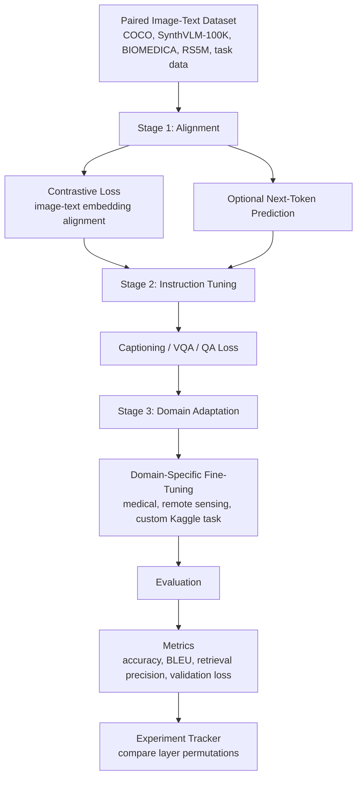

# Proposed VLM Architecture

Source: `Research.pdf`

This proposal keeps the VLM modular so Kaggle experiments can swap backbones, fusion layers, PEFT methods, and training stages without rewriting the full pipeline.

## High-Level Architecture

```mermaid
flowchart LR
    subgraph OUTER[" "]
        direction LR

        D["<b>Dataset</b><br/><br/>- WildFireVQA JSON annotations<br/>- FLAME-3 RGB images<br/>- FLAME-3 thermal JPG/TIFF<br/>- Question-answer pairs"]

        P["<b>Data Preprocessing</b><br/><br/>- Path resolution<br/>- RGB/thermal pairing<br/>- Temperature summary extraction<br/>- Train/validation split<br/>- Image augmentation"]

        subgraph M["<b>Custom Generative VLM Framework</b>"]
            direction TB
            M1["RGB Vision Encoder<br/>(CLIP / ViT / Swin)"]
            M2["Thermal Vision Encoder<br/>(shared or separate weights)"]
            M3["Visual Projection<br/>(linear / MLP / adapter)"]
            M4["Question Encoder<br/>(T5 / small LLM embeddings)"]
            M5["RGB-Thermal Fusion<br/>(concat / cross-attention / Q-Former)"]
            M6["Text Decoder<br/>(generates free-form answer)"]
        end

        E["<b>Evaluation and Comparative Analysis</b><br/><br/>BLEU / ROUGE-L<br/>Exact Match<br/>Semantic Similarity<br/>Category-wise Scores<br/>Ablation Comparison"]

        B["<b>Take Final Best Model</b>"]

        N["<b>New Wildfire Samples</b><br/><br/>Collect / mount additional<br/>RGB-thermal UAV fire images"]

        R["<b>Proposed Work Output</b><br/><br/>- Data preprocessing pipeline<br/>- RGB-thermal generative VLM<br/>- Layer permutation experiments<br/>- Evaluation and comparison<br/>- Final Kaggle-ready model"]

        D --> P --> M --> E --> B --> N
        N --> R
        N -.future data.-> P
        E -.best config.-> R

        style OUTER fill:#ffffff,stroke:#75a3ff,stroke-width:3px
        style D fill:#92d050,stroke:#4f6570,stroke-width:2px,color:#000
        style N fill:#92d050,stroke:#4f6570,stroke-width:2px,color:#000
        style P fill:#13aadd,stroke:#4f6570,stroke-width:2px,color:#000
        style M fill:#aaa7dc,stroke:#4f6570,stroke-width:2px,color:#000
        style M1 fill:#bde5e8,stroke:#4f6570,stroke-width:1px,color:#000
        style M2 fill:#bde5e8,stroke:#4f6570,stroke-width:1px,color:#000
        style M3 fill:#bde5e8,stroke:#4f6570,stroke-width:1px,color:#000
        style M4 fill:#bde5e8,stroke:#4f6570,stroke-width:1px,color:#000
        style M5 fill:#bde5e8,stroke:#4f6570,stroke-width:1px,color:#000
        style M6 fill:#bde5e8,stroke:#4f6570,stroke-width:1px,color:#000
        style E fill:#eef3df,stroke:#4f6570,stroke-width:2px,color:#000
        style B fill:#338a9b,stroke:#4f6570,stroke-width:2px,color:#000
        style R fill:#338a9b,stroke:#4f6570,stroke-width:2px,color:#000
    end
```



## Training Flow



## Configurable Experiment Axes

| Layer / Module | Candidate Options | Kaggle-Oriented Default |
|---|---|---|
| Base model | CLIP, InternVL, SynthVLM, Molmo | CLIP or small open-weight VLM first |
| Vision encoder | CNN, ViT, Swin, Hybrid CNN + Swin/ViT | ViT for simplicity, Swin for efficiency/local-global features |
| Text encoder | LSTM, Transformer, small decoder LM | Transformer |
| Projection layer | Linear, MLP, adapter block | Linear first, adapter/MLP if underfitting |
| Fusion layer | Concatenation, cross-attention, Q-Former, Mixture of Experts | Concatenation baseline, cross-attention upgrade |
| PEFT method | LoRA, AdaLoRA, QLoRA, adapters, prompt tuning, normalization-only tuning | LoRA or QLoRA |
| Training loss | Contrastive, next-token prediction, captioning CE, VQA CE | Contrastive + task loss |
| Fine-tuning stage | Alignment, instruction tuning, domain adaptation | Alignment -> instruction tuning -> domain adaptation |
| Inference strategy | Single model, zero-shot ensemble, confidence merge, test-time prompt tuning | Single model baseline, ensemble later |

## Proposed Baseline

Start with the smallest useful architecture:

```text
Image -> ViT/CLIP vision encoder -> projection layer
Text  -> Transformer text encoder -> projection layer
Projected embeddings -> contrastive alignment
Aligned representation -> captioning/VQA/classification head
Fine-tune with LoRA or QLoRA
```

This baseline is practical for Kaggle because it keeps most pretrained weights frozen and only trains lightweight adaptation layers.

## Recommended Experiment Order

1. **Baseline retrieval/alignment**
   - Vision encoder: CLIP ViT
   - Text encoder: CLIP text transformer
   - Fusion: shared embedding space
   - Loss: contrastive loss
   - PEFT: none or LoRA on projection layers

2. **Task-specific VQA or captioning**
   - Add decoder/task head.
   - Keep the vision backbone frozen.
   - Tune projection, fusion, and task head.

3. **Fusion-layer comparison**
   - Compare concatenation vs cross-attention vs Q-Former/query-token fusion.
   - Keep the same dataset split and metrics.

4. **PEFT comparison**
   - Compare LoRA, AdaLoRA, QLoRA, adapters, prompt tuning, and normalization-only tuning.
   - Track trainable parameter count, GPU memory, validation score, and epoch time.

5. **Backbone comparison**
   - Compare ViT, Swin, and hybrid CNN-transformer variants.
   - Use smaller image resolution first to stay within Kaggle GPU limits.

6. **Domain adaptation**
   - Use BIOMEDICA-like data for medical tasks, RS5M-like data for remote sensing, or the target Kaggle dataset.
   - Add instruction tuning after alignment if the task requires reasoning or natural-language answers.

7. **Ensembling and test-time adaptation**
   - Try confidence-based model merging or zero-shot ensembles after strong single-model baselines exist.
   - Add test-time prompt tuning only if validation behavior suggests prompt sensitivity.

## Kaggle Constraints To Design Around

- Freeze large pretrained backbones wherever possible.
- Prefer LoRA, QLoRA, adapters, prompt tuning, or normalization-only tuning over full fine-tuning.
- Use small batches with gradient accumulation.
- Cache image/text embeddings for early fusion experiments.
- Track every permutation with the same validation split.
- Keep the architecture config-driven so layers can be swapped cleanly.

## Suggested Config Skeleton

```yaml
model:
  base_model: clip
  vision_encoder: vit
  text_encoder: transformer
  projection: linear
  fusion: contrastive_shared_space
  task_head: retrieval

training:
  stages:
    - alignment
    - instruction_tuning
    - domain_adaptation
  losses:
    alignment: contrastive
    language: next_token_prediction
    task: cross_entropy

peft:
  method: lora
  target_modules:
    - projection
    - fusion
    - task_head

kaggle:
  freeze_backbones: true
  mixed_precision: true
  gradient_accumulation: true
  cache_embeddings: true
```

## Notes From Research.pdf

- Open-weight VLM choices mentioned: CLIP, InternVL, SynthVLM, and Molmo.
- Vision backbone trade-offs: ViT has global patch attention and is strong for large-scale tasks; Swin is more efficient and captures local plus global structure; hybrid designs can help domain-specific image types.
- Training should be multi-stage: alignment first, then instruction tuning, then domain adaptation.
- PEFT methods are important for Kaggle constraints: LoRA, AdaLoRA, QLoRA, adapters, prompt tuning, skip tuning, LoRA-XS, and normalization-only tuning are all candidate knobs.
- Later experiments can include mixture-of-experts, uncertainty-guided merging, zero-shot ensembles, and privacy-preserving variants when the baseline is stable.
